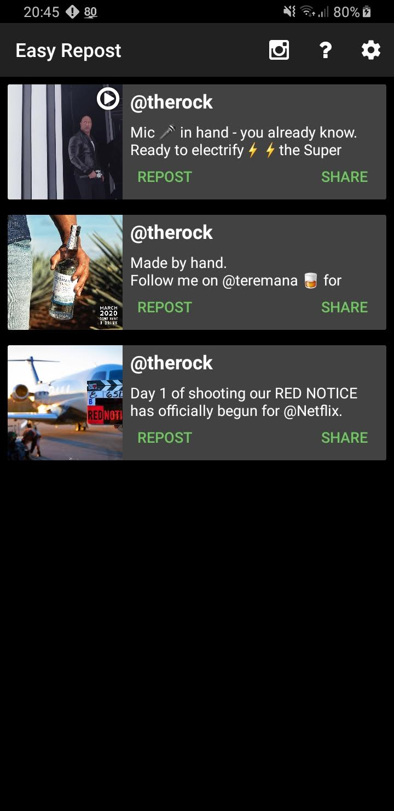

<h1 align="center">
  Easy Repost and Downloader for Instagram
</h1>

## Screenshots

## Description
Download or repost public instagram posts easily by selecting "Copy Link" in Instagram.

## Download
* Google Play: https://play.google.com/store/apps/details?id=net.schueller.instarepost
* F-Droid: https://f-droid.org/packages/net.schueller.instarepost/

## Help Translate
* https://hosted.weblate.org/projects/easyrepost/

## Features
* Download or Repost Images and Videos
* Copies captions into post

## Todo
* cleanup code, lots of duplication and wierd things
* Fix multiple downloads causing `has leaked IntentReceiver`

## Contribution
Whether you have ideas, translations, design changes, code cleaning, or real heavy code changes, help is always welcome.

## Donate

<noscript></noscript>

BCH:

     bitcoincash:qp8uwzjfw4nce7terjre80u38kfvcnxf5glm5rv676

BTC:

     1Lv4Etacsjj1yi3AUGbzZZrcHHhbVbrNkY

     
     1LoTXo728HzYTtyfbkaf5ewSRvu8ABTDPm

ETH:

     0xe5faC92651dD9Cf6ebab9C8B47d625502B334096

